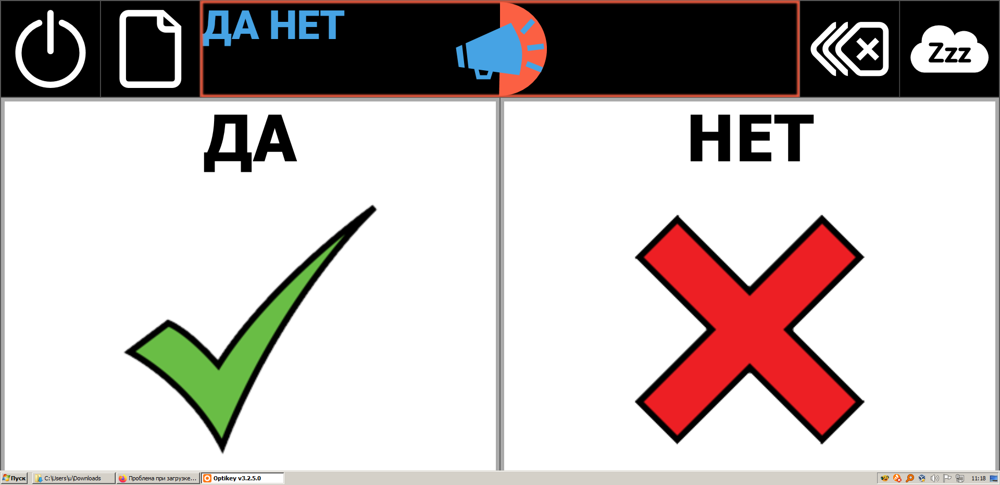
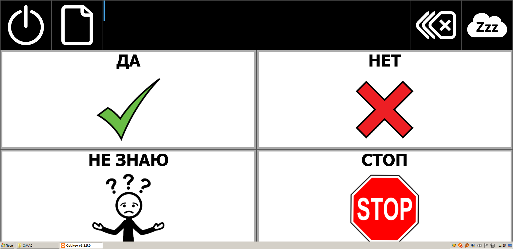

# aac-cards-obf

Карточки __Альтернативной и дополненной коммуникации (АДК) (англ. — Alternative and Augmentative Communication, AAC)__ в формате [OpenBoard](https://www.openboardformat.org/). Карточки созданы в программе [CoughDrop](https://www.coughdrop.com/). Формат __.obz__ поддерживается в том числе программой [Optikey Symbol](http://optikey.org/applications/optikey-symbol).

__Лицензия:__ [Creative Commons BY-SA 4.0](https://creativecommons.org/licenses/by-sa/4.0/deed.ru).

## Да-Нет

- __Описание:__ Две карточки: "Да" и "Нет".
- __Ссылка:__ <https://app.mycoughdrop.com/pasha_liubetski/yesno>.
- __.OBZ-файл:__ [./Yes-No.obz](Yes-No.obz).
- __.PDF-файл:__ [./Yes-No.pdf](Yes-No.pdf).
- __Автор пиктограмм:__ Sergio Palao. Источник: ARASAAC (<http://www.arasaac.org>). Лицензия: CC (BY-NC-SA). Владелец: Правительство Арагона (Испания).

## 4 карточки

- __Описание:__ Четыре карточки: "Да", "Нет", "Не знаю", "Стоп".
- __Ссылка:__ <https://app.mycoughdrop.com/pasha_liubetski/4cards>.
- __.OBZ-файл:__ [./4cards.obz](4cards.obz).
- __.PDF-файл:__ [./4cards.pdf](4cards.pdf).
- __Автор пиктограмм:__ Sergio Palao. Источник: ARASAAC (<http://www.arasaac.org>). Лицензия: CC (BY-NC-SA). Владелец: Правительство Арагона (Испания).

