# Карточки АДК в .obz (CoughDrop + OptiKey Symbol)

Карточки __Альтернативной и дополненной коммуникации (АДК) (англ. — Alternative and Augmentative Communication, AAC)__ в формате [OpenBoard](https://www.openboardformat.org/). Карточки созданы в программе [CoughDrop](https://www.coughdrop.com/). Формат __.obz__ поддерживается в том числе программой [Optikey Symbol](http://optikey.org/applications/optikey-symbol).

__Лицензия:__ [Creative Commons BY-SA 4.0](https://creativecommons.org/licenses/by-sa/4.0/deed.ru). Автор пиктограмм: Sergio Palao. Источник: ARASAAC (<http://www.arasaac.org>). Лицензия: CC (BY-NC-SA). Владелец: Правительство Арагона (Испания).

## Карточки

Официальные русскоязычные карточки для OptiKey Symbol от авторов программы: <https://github.com/OptiKey/OptiKey/raw/gh-pages/Symbols/pageset_ru-RU.obz>

### Да-Нет

- __Описание:__ Две карточки: "Да" и "Нет".
- __Ссылка:__ <https://app.mycoughdrop.com/pasha_liubetski/yesno>.
- __.OBZ-файл:__ [./Yes-No.obz](Yes-No.obz).
- __.PDF-файл:__ [./Yes-No.pdf](Yes-No.pdf).

### 4 карточки

- __Описание:__ Четыре карточки: "Да", "Нет", "Не знаю", "Стоп".
- __Ссылка:__ <https://app.mycoughdrop.com/pasha_liubetski/4cards>.
- __.OBZ-файл:__ [./4cards.obz](4cards.obz).
- __.PDF-файл:__ [./4cards.pdf](4cards.pdf).

### AAC-cards-OBF

- __Описание:__ Набор карточек, повторяющий карточки linka_boards: <https://github.com/pasha-liubetski/linka_boards>.
- __Ссылка:__ <https://app.mycoughdrop.com/pasha_liubetski/aac-cards-obf>.
- __.OBZ-файл:__ [./AAC-cards-OBF.obz](AAC-cards-OBF.obz).
- __.PDF-файл:__ [./AAC-cards-OBF.pdf](AAC-cards-OBF.pdf).

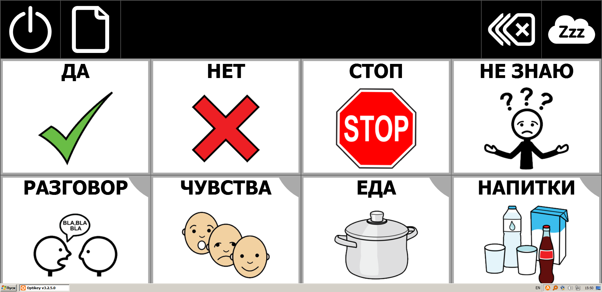

## HOW-TO

### Как открывать .OBZ-файлы в Optikey Symbol

1. Кликните по экрану правой кнопкой мыши, выберите пункт __Management Console (Settings)__ / __Консоль Управления (Настройки)__ (первый в списке).

    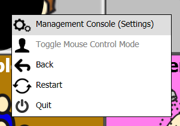

2. В разделе __Words__ поменяйте __Keyboard language__ и __User interface language__ на __Russian (Russia) / Русский (Россия)__.

    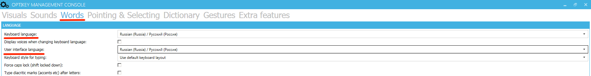

3. В разделе __Extra features__ в подразделе __COMMUNIKATE__ поставьте галочку __Произнести текст при выборе CommuniKate__ и нажмите кнопку __"Поиск"__.

    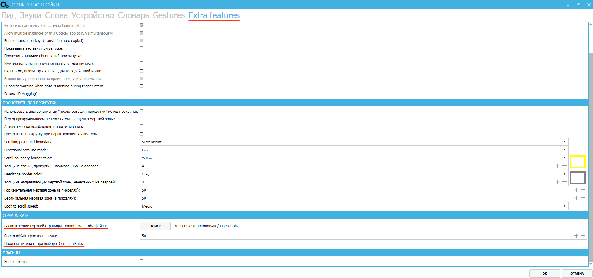
  
4. Выберите нужный __.obz-файл__ и нажмите __"Открыть"__.

    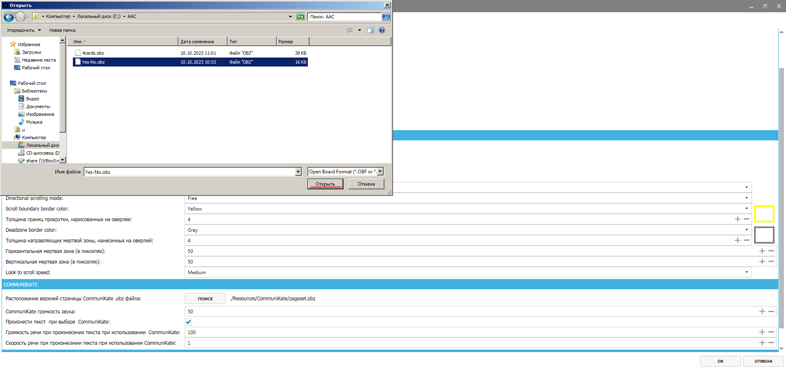

5. Нажмите __OK__. Программа перезапустится и откроет нужный набор карточек.

    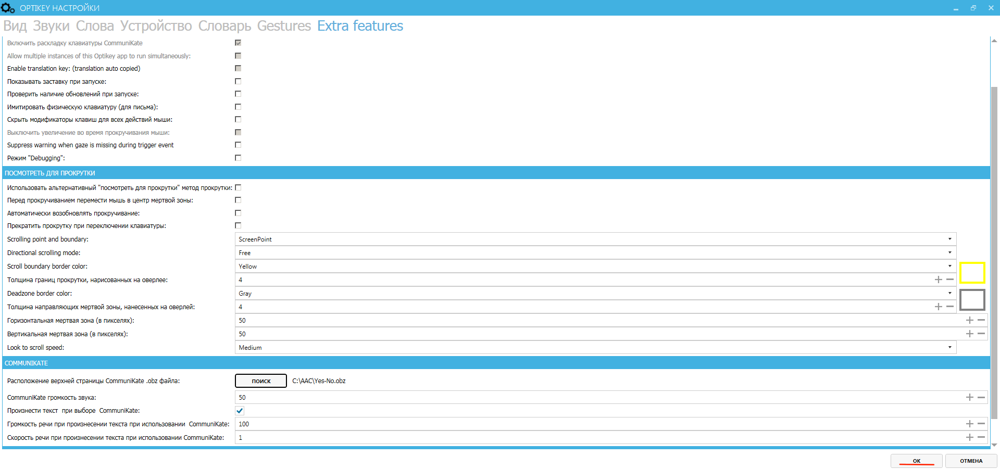

### Как экспортировать карточки CoughDrop в .OBZ

1. Если вы находитесь в **Режиме разговора (Speak mode)**, выйдите из него: **⚙ → Exit Speak Mode**

    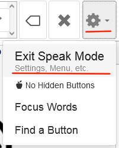

2. **More → Other Actions**.

    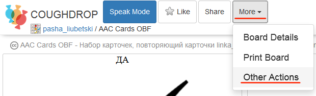

3. Нажмите кнопку **Download Board**.

    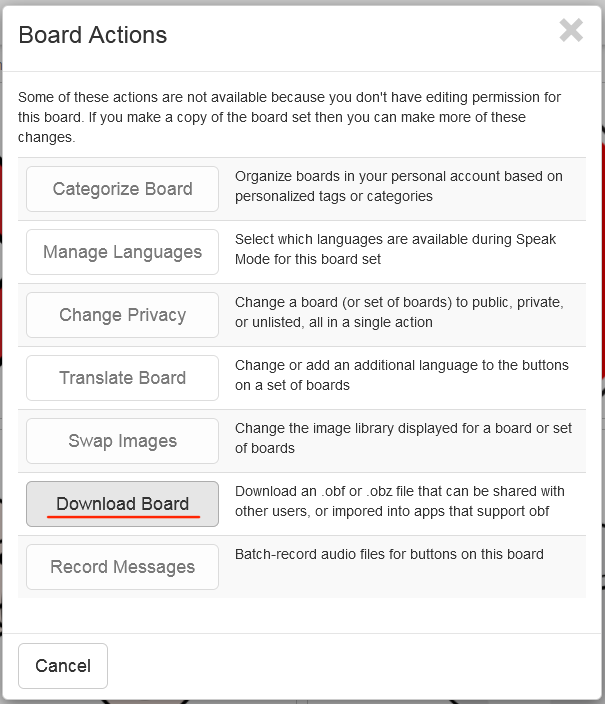

4. Нажмите кнопку **Download full board set**.

    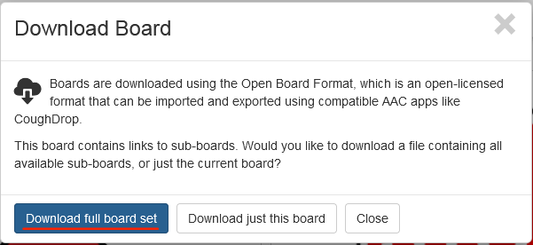

5. Нажмите на ссылку **Download board(s) to your computer**.

    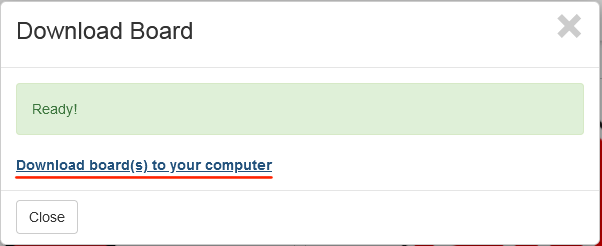
