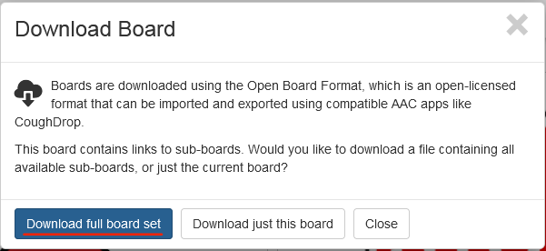
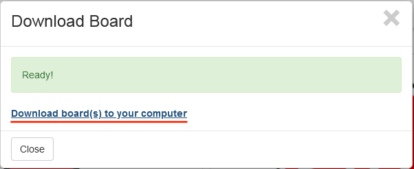

# Как экспортировать карточки CoughDrop в .OBZ

1. Если вы находитесь в **Режиме разговора (Speak mode)**, выйдите из него: **⚙ → Exit Speak Mode**

    

2. **More → Other Actions**.

    

3. Нажмите кнопку **Download Board**.

    

4. Нажмите кнопку **Download full board set**.

    

5. Нажмите на ссылку **Download board(s) to your computer**.

    
