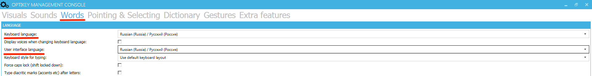
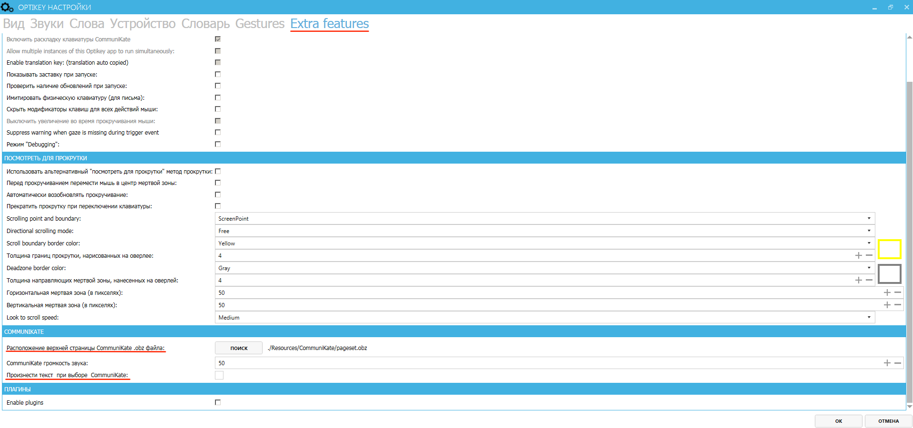
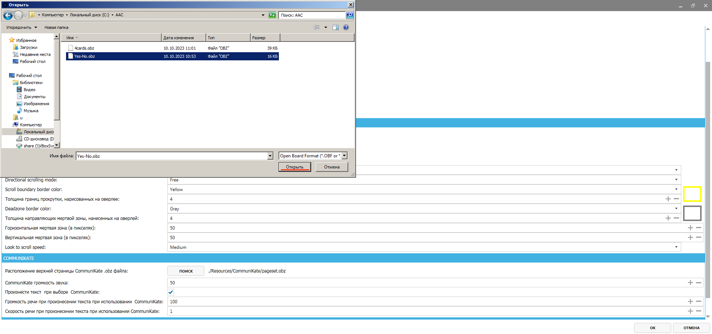
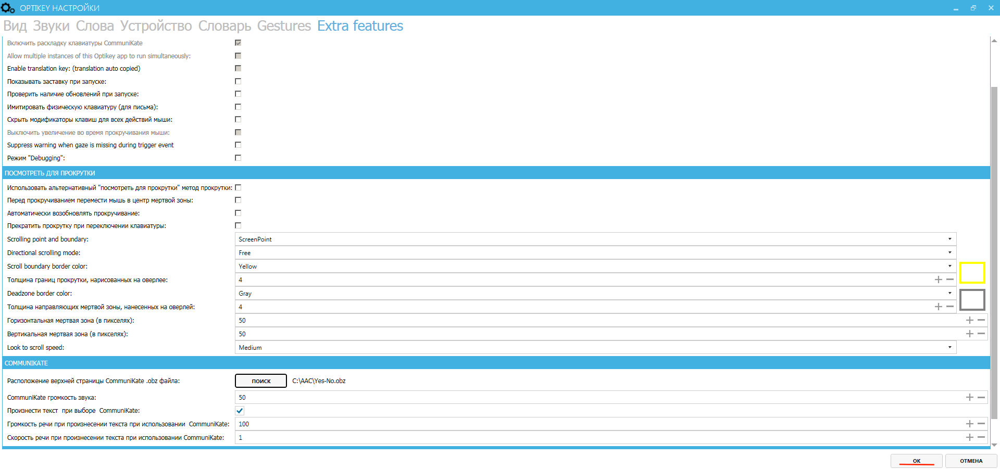

# Как открывать .OBZ-файлы в OptiKey Symbol

1. Кликните по экрану правой кнопкой мыши, выберите пункт __Management Console (Settings)__ / __Консоль Управления (Настройки)__ (первый в списке).

    

2. В разделе __Words__ поменяйте __Keyboard language__ и __User interface language__ на __Russian (Russia) / Русский (Россия)__.

    

3. В разделе __Extra features__ в подразделе __COMMUNIKATE__ поставьте галочку __Произнести текст при выборе CommuniKate__ и нажмите кнопку __"Поиск"__.

    
  
4. Выберите нужный __.obz-файл__ и нажмите __"Открыть"__.

    

5. Нажмите __OK__. Программа перезапустится и откроет нужный набор карточек.

    
